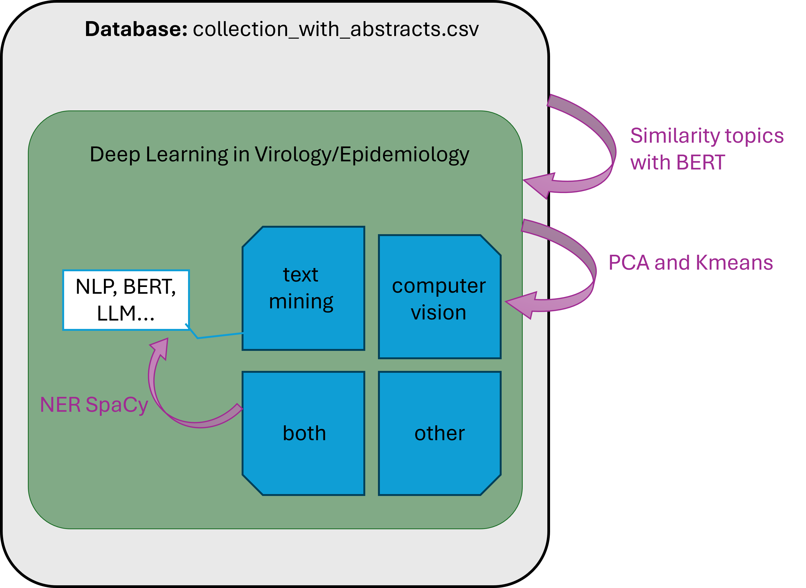
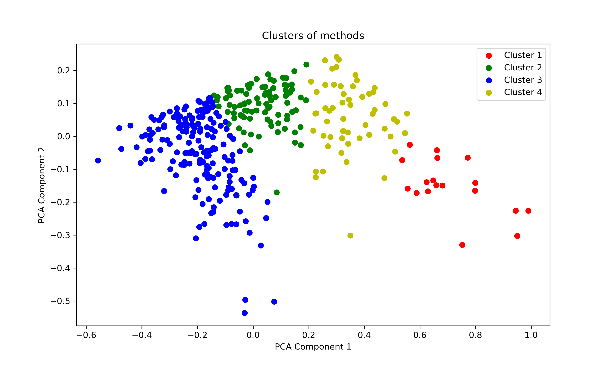

# Filtering semantically with BERT 

## Introduction 

This application concentrate to specific topics about the medicine and technology, such as: Virology and Epidemiology, and the context of computational methods apply in this sector, Deep Learning and the branches of Natural Language and Computer Vision. 

### Objective

Create automatic filtering considering Deep Learning and techniques of NLP, to filter a dataset with a screening papers with advanced filtering by keywords with logic operators, as a query.


## Methodology

In this instance, the big task was partitioned in three tasks to create a semantic cascade of filtering approach. 

Starting with the complete database, the relevant subgroup of papers was selected applying the semantic of Bidirectional Encoder Representations for Transformers (BERT), considering the cosine of similarity between the embedding created by [bert-base-uncased](https://huggingface.co/google-bert/bert-base-uncased) pre-trained model and the descriptors initialized manually with the content of keywords of the creation of database. 

With the relevant papers filtering with the BERT model, the database decreased and passed to another stage. To apply classification of the database, the PCA was applied to summary the dimensions of vectorial space of embeddings. To continue the analysis and classification the Kmeans is considered to clusterizing the topics of embedding with more similarities. Emphasizing fours classes listed, ["text mining", "computer vision", "both", "other"]. To simplify, the label "both" was changed as a concatenation between the two first labels, "text mining and computer vision".

Currently, the new attributes already inserted in the dataframe, the last aim is extract the central topic and technique include in each relevant paper. For that, the descriptor of techniques in deep learning is conectaded with entities created by function of NER pipeline of SpaCy package.

Figure 1 is a summary of process applied in this application, it represents the descriptions mentioned previously.


<center>Figure 1: Stagins of papers filtering process.</center>

## Materials and Details
Applying the methodology, the respective files was considered organized as shown in Table 1.


<center>Table 1: Contents of repository and descriptions.</center>

| Directory/File | Description |
| ---| ---| 
|**DB/** | Database used in this application - [README.md](./DB/README.md) |
|**model/** | Model [(the model created in the last execution is available in this link.)](https://1drv.ms/u/c/154b94a1d2543dda/EXQQ7n8ADZ9Lj-H76dFhY6cBCLomKjJ4luA86t2q1Zmm7g?e=UwhCoF) | 
| **requirements.txt** | The requirements used to execution of this code.  |
|**database_class.py** | Class for specific Pythorch approach, with virology paper dataframe. | 
|**preprocessing_data.py** | Methods considering the preprocess of data, such as adjust the inputs, load db and models. | 
| **processing_data.py** | Create the embedding data, initialize parameters, classify and extract methods. |
|**utils.py**| Methods to save and export file.|
|**main.py** | Execution of code | 


### Environment
The code was created and executed in a conda environment. The hardware applied has the specs: 
```
Processor: i9-13900H
Graphical Card: NVIDIA GeForce RTX 4070
RAM Memory: 32 GB DDR5
Storage: 1TB SSD NVMe
```

### Execution

The packages used in this repository, such Pytorch, Pandas, Numpy, Onnx, are listed in the requirements file, and could be updated by the instruction on the terminal. 

```sh
pip install -r requirements.txt 

```

The execution just need the python 3.10 pre-installed:
```
python main.py
```

The code execution, applying trained stage only for classification linear layer in this machine was approximatelly **10 - 20min**. The example of terminal output is: 

```sh
Using device: cuda
The weights of classification layer was initilized.
Model exported to ONNX file sucessfully, path: ./model/bert_sequence_classification.onnx
Silhouette Score: 0.39557167887687683
Methods used was classified.
The ./DB/output/relevant_papers.csv saved sucessfully.
---------------------------------------------------------------------------------------------
Total of relevant papers (task 1): 344
---------------------------------------------------------------------------------------------
  Number of paper of computer vision: 90         Path of file ./DB/output/computer_vision.csv   
      Number of paper of text mining: 18         Path of file ./DB/output/text_mining.csv
             Number of paper of both: 180        Path of file ./DB/output/both.csv
            Number of paper of other: 56         Path of file ./DB/output/other.csv
---------------------------------------------------------------------------------------------
Summary statistics:
---------------------------------------------------------------------------------------------
Total input: 11450 (100 %).
Relevant to DL in Virology/Epidemiology: 344 (3.00 % of total).
---------------------------------------------------------------------------------------------
           Papers of computer vision: 90 (0.79 % of total)       (26.16 % of relevant papers)
                Papers of text mining: 18 (0.16 % of total)      (5.23 % of relevant papers)
                     Papers of both: 180 (1.57 % of total)       (52.33 % of relevant papers)
                     Papers of other: 56 (0.49 % of total)       (16.28 % of relevant papers)
Duration of execution: 9.27 min
```

The exported model onnx could be visualized with [NETRON](https://netron.app/), or another app to create a visual interaction with layers. Also can be applied in another application as a load model input, it extends the possibilities of to share as a product software.  

With the execution of `main.py` code, some files will be generate: 
- The task 1 will export the [model](./model/bert_embeddings_model.onnx)
- The task 2 will generate a [figure](./DB/output/figure_kmeans.png) of kmeans plot of relevant papers, as shown in Figure 2. It represents the four possibilities of semantic labels recognized from embeddings and BERT model. 
- The task 3 will create four csv files considering the methods used in each papers contents. 



<center>Figure 2: Kmeans of 4 clusters of relevant papers. </center>

## Conclusion


This approach considers filtering and classification of database items. As a self-supervised application, the database does not have automatic labels for target elements, so semantic context behaviors with descriptors may be more effective for clustering sentence and sector meaning rather than the keyword-based approach, which is a deterministic meaning approach.

The running example presented in the previous section improves filtering in manual analysis for individual studies. If the user needs articles to be classified as 'both', the user will focus on 180 studies instead of 11450 articles

Task 3 focuses on extracting techniques applied to each article in the database. To create the list of methods, descriptors are considered, and are present in the final output, already classified in an individual file. However, articles without an abstract are more imprecise for verifying semantics and extracting the techniques applied to them.


Therefore, the detailed results presented in the terminal output consider the reduced amount of articles for users. The relevant articles are smaller than the input DB, in this case and execution, the model represented as 3 % of the total database. It also took into account, the Silhouette Score: 0.396 of clustering by kmeans presents the classes as separated as moderate groups, in other words, they are well defined and not spaced.